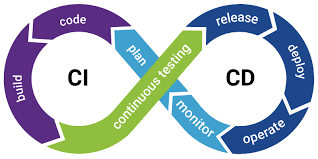
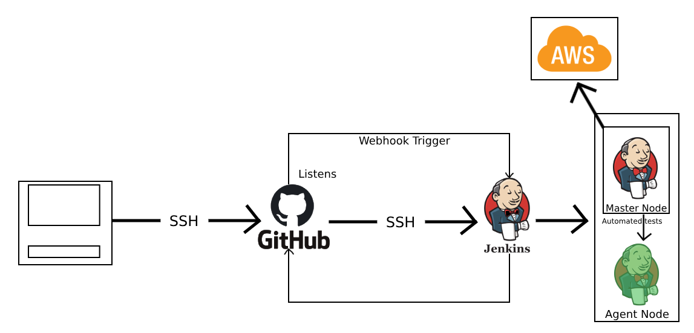
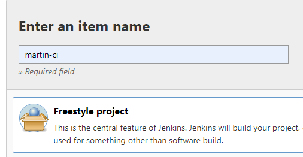
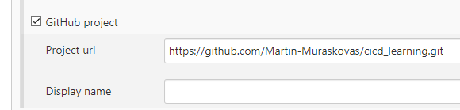
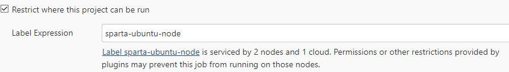
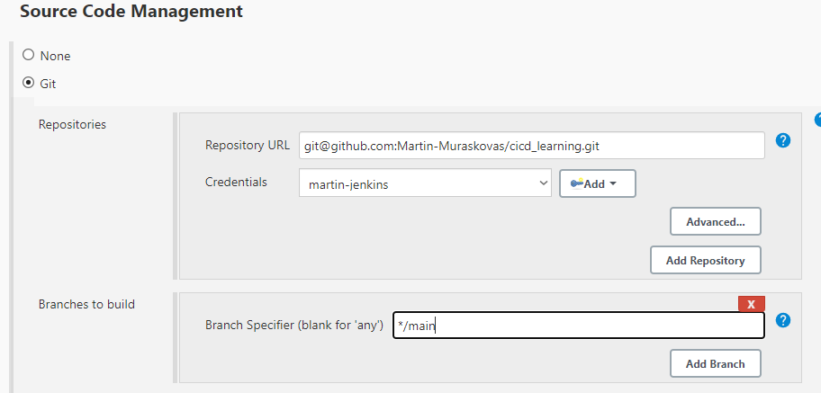
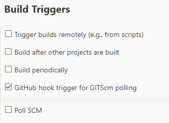
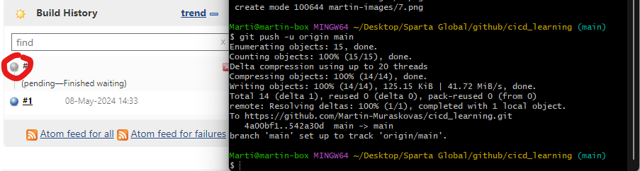
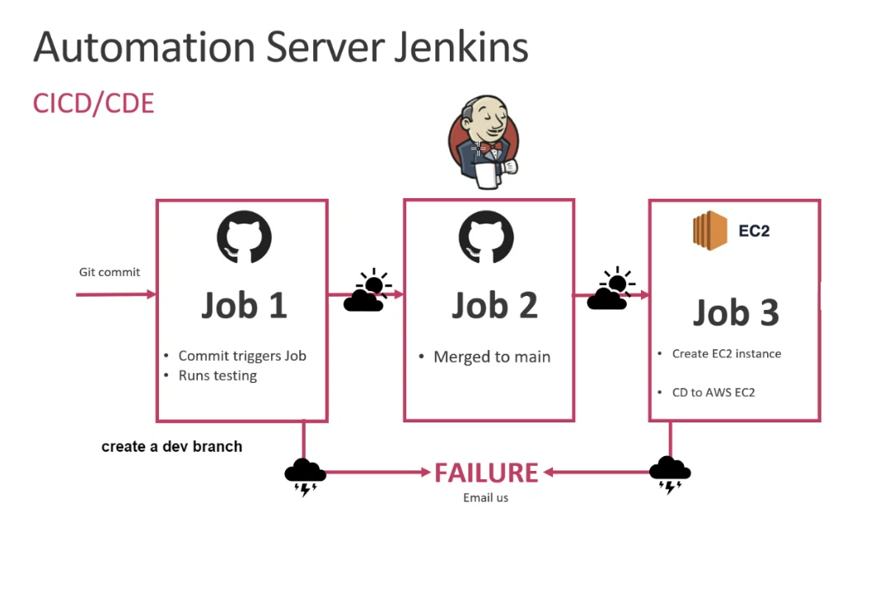
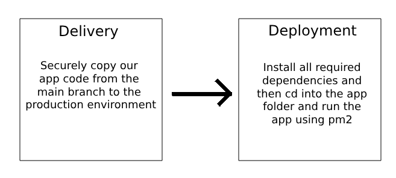

- [CI/CD - What? Why? When? How?](#cicd---what-why-when-how)
  - [What is CI/CD?](#what-is-cicd)
  - [Why should we use CI/CD?](#why-should-we-use-cicd)
  - [When is CI/CD appropriate?](#when-is-cicd-appropriate)
  - [How can CI/CD be implemented?](#how-can-cicd-be-implemented)
  - [What is a Webhook?](#what-is-a-webhook)
  - [What is the difference between delivery and deployment in production?](#what-is-the-difference-between-delivery-and-deployment-in-production)
  - [Visualising how CI/CD works](#visualising-how-cicd-works)
- [Setting up Continuous Integration using Jenkins](#setting-up-continuous-integration-using-jenkins)
  - [1. New item](#1-new-item)
  - [2. Enter the Name -\> Select Freestyle Project](#2-enter-the-name---select-freestyle-project)
  - [3. Set it as a GitHub project](#3-set-it-as-a-github-project)
  - [4. Restrict where the project can be run.](#4-restrict-where-the-project-can-be-run)
  - [5. Create an SSH key pair](#5-create-an-ssh-key-pair)
  - [6. Creating a webhook](#6-creating-a-webhook)
  - [7. Save, Build, and Test](#7-save-build-and-test)
- [CICD using Jenkins](#cicd-using-jenkins)
  - [High Level Overview](#high-level-overview)
  - [Job Plan](#job-plan)
  - [Task 1 - Creating a dev branch in the app repository.](#task-1---creating-a-dev-branch-in-the-app-repository)
  - [Task 2 - CI-Merge - Create 2 Jobs to test and then merge code committed to the dev branch](#task-2---ci-merge---create-2-jobs-to-test-and-then-merge-code-committed-to-the-dev-branch)
    - [Diagram of Task 2](#diagram-of-task-2)
  - [Task 3 - CD](#task-3---cd)
  - [Setting up our production environment](#setting-up-our-production-environment)
    - [Diagram of Task 3 - Setting up the Production Environment](#diagram-of-task-3---setting-up-the-production-environment)
  - [Task 4 - Continuous Delivery and Continuous Deployment](#task-4---continuous-delivery-and-continuous-deployment)
  - [Continuous Delivery](#continuous-delivery)
  - [Continuous Deployment](#continuous-deployment)
    - [Diagram of Task 4](#diagram-of-task-4)
  - [Continuous Deployment Continued](#continuous-deployment-continued)

<br>

# CI/CD - What? Why? When? How?
## What is CI/CD?
 <br>
- CI/CD stands for Continuous Integration/Continuous Deployment.
-  It is a software development practice that aims to automate the process of integrating code changes into a shared repository which is called continuous integration, and then automatically deploying those changes to production or other environments, which is called continuous deployment.
## Why should we use CI/CD?
CI/CD has numerous benefits:
  - Maximized creativity and efficiency in software development and release.
  - Higher efficiency and increased productivity.
  - Reduced risk of defects.
  - Faster product delivery.
  - Quick rollback if issues arise.
  - Automation reduces costs.
  - Fault isolation.
  - Accelerated release rate.
## When is CI/CD appropriate?
There are various situations where the implementation of CI/CD is not only appropriate but also essential:
   - Team Collaboration
     - Teams may be impelmenting frequent code changes
   - Automated testing
   - Fast and Reliable deployment
   - Continous approach
     - CI/CD uses a continous feedback loop where the development, testing, and operations teams are linked. This allows for issues to be quickly solved.
## How can CI/CD be implemented?
Jenkins is a good way of implementing CI/CD. You are able to use jobs to create a pipeline where the CI part and the CD part can be abstracted into smaller jobs that link together to create the whole pipeline.


## What is a Webhook?
A webhook is an HTTP-based callback function that allows lightweight, event-driven communication between two applications.

Webhooks are triggered by specific events and send data from one application to another.

They are commonly used to automate processes, such as sending notifications, updating data, or triggering actions in response to events.


## What is the difference between delivery and deployment in production?
In software development, delivery refers to the process of making the software available for testing or release. 

Deployment includes activities such as configuring the software, setting up the necessary infrastructure, and ensuring that the software runs smoothly in the production environment.

## Visualising how CI/CD works


# Setting up Continuous Integration using Jenkins

## 1. New item
Select new item on the Jenkins Burger Menu<br>

## 2. Enter the Name -> Select Freestyle Project


## 3. Set it as a GitHub project


## 4. Restrict where the project can be run.
In our case we want it run on an instance that is running ubuntu with node installed.


## 5. Create an SSH key pair
Set the private key up on Jenkins:<br>
<br>
Set the public key up on GitHub:<br>
<br>

## 6. Creating a webhook
Tick GitHub hook trigger as a build trigger option.<br>
<br>
Go to GitHub and set the Payload URL as the Jenkins IP appended with `/github-webhook/`<br>
<br>
Select pushes, and pull requests as triggers. <br>
<br>

## 7. Save, Build, and Test
Save your project, and create your first build.<br>
To test that the webhook is working, commit and push something to your GitHub repository.<br>
This is the expected outcome:<br>


# CICD using Jenkins

## High Level Overview


## Job Plan
- Job 1 CI<br>
  - Pushing changes to a git repository will trigger a webhook that will automatically test the newest code that has been puhed to the repo.
- Job 2 CI-Merge
  - Once Job 1 has been triggered and completed, job 2 will be activated.
  - A dev branch is required for this.
  - Once changes have been saved to the dev branch, these changes should be tested, and if the tests pass, they will then be merged with the main branch.
- Job 3 CD
  - Create an EC-2 instance
  - Set up the security groups and dependencies.
  - Get the latest code from the 2nd job onto the instance.
  - SSH in and manually test this code
- Job 4 CDE
  - Give Jenkins the SSH credentials to login to the EC-2 instance from Job 3
  - Have Jenkins navigate to the app folder and run the app in the background.


## Task 1 - Creating a dev branch in the app repository.
Create a new github repo and push the app folder to this repo:<br>
https://github.com/Martin-Muraskovas/cicd_learning<br>

## Task 2 - CI-Merge - Create 2 Jobs to test and then merge code committed to the dev branch
1. Create a dev branch using git.<br>
`git checkout -b dev`

2. Make a change to the dev branch locally, push to github. Your jenkins job should trigger a new job if the tests pass on the dev branch.<br>
Follow this [guide](https://github.com/Martin-Muraskovas/cicd_learning/blob/main/CICD.md#setting-up-continuous-integration-using-jenkins), however change the branch specifier as shown below.
<br>
<br>

3. Your new job should merge the code with the main branch on github.
Bad practice to use git commands. Use a Jenkins plugin instead.<br>
Select merge before build.<br>
<br>
<br>


### Diagram of Task 2
<br>

## Task 3 - CD
Create an EC-2 instance to be used as a production environment.
This instance should have `Ubuntu 18.04 LTS` as the image.
The security group should allow:
   - Port 22 for SSH
   - Port 8080 for Jenkins
   - Port 3000 for node.js
   - Port 80 for HTTP<br>

We also need to bypass user input for when we are SSHing into our instance.
We also need to install node.js and nginx.
## Setting up our production environment
1. Create an EC2 instance from an image. In our case we are using this image:
   - https://eu-west-1.console.aws.amazon.com/ec2/home?region=eu-west-1#ImageDetails:imageId=ami-02f0341ac93c96375
   - Give the following security groups:
     - Port 22 for SSH
     - Port 8080 for Jenkins
     - Port 3000 for node.js
     - Port 80 for HTTP<br>
2. Make a new job on Jenkins. Ensure it is a Freestyle project.
3. Set up the GitHub project to be the main branch as this is where we have our code.
    <br>
    Change dev to main:<br>
    <br>
4. Add AWS SSH credentials.
   Need to add an image of where to change the settings here.
5. Execute a shell script upon starting the job.
    ```
    # bypass key checking step/option
    # ssh into ec2
    ssh -i "tech258.pem" ubuntu@ec2-3-255-154-125.eu-west-1.compute.amazonaws.com -o StrictHostKeyChecking=no <<EOF

    # run update and upgrade
    sudo apt-get update -y
    sudo apt-get upgrade -y

    # install nginx
    sudo apt-get install nginx -y
    # visit public ip to ensure nginx is running
    sudo systemctl enable nginx
    EOF
    ```
This code should allow Jenkins to SSH into your instance and configure nginx. This can be confirmed by visiting the public IP of your production environment (the EC2 we configured in step 1).

### Diagram of Task 3 - Setting up the Production Environment
<br>

## Task 4 - Continuous Delivery and Continuous Deployment
## Continuous Delivery
1. Go back to the Job you began from the last section.
2. Append the shell script with the following commands:
    ```
    # copy code from main branch
    rsync -avz -e "ssh -o StrictHostKeyChecking=no" app ubuntu@3.252.61.112:/home/ubuntu
    rsync -avz -e "ssh -o StrictHostKeyChecking=no" environment ubuntu@3.252.61.112:/home/ubuntu
    ```
    This code will copy the updated code from the main branch in your Jenkins node onto your EC2 production environment.

## Continuous Deployment
1. Go back to the same job from the continuous delivery section.
2. Append the shell script with the following commands:
    ```
    # install the required dependencies using provision.sh
    ssh -o "StrictHostKeyChecking=no" ubuntu@3.252.61.112 <<EOF
        sudo chmod +x ~/environment/app/provision.sh
        #sudo chmod +x ~/environment/db/provision.sh
        #sudo bash ./environment/db/provision.sh
        sudo bash ./environment/app/provision.sh
        cd app
        pm2 kill
        pm2 start app.js
    EOF
    ```
3. The provision script is used to install all of the dependencies required to run the app.
```
#!/bin/bash

# Update the sources list
sudo apt-get update -y

# upgrade any packages available
sudo apt-get upgrade -y


# install git
sudo apt-get install git -y

# install nodejs
sudo apt-get install python-software-properties -y
curl -sL https://deb.nodesource.com/setup_10.x | sudo -E bash -
sudo apt-get install nodejs -y

# npm install
cd app
sudo -E npm install
# install pm2
sudo npm install pm2 -g
sudo apt-get install nginx -y

# remove the old file and add our one
#sudo rm /etc/nginx/sites-available/default
#sudo cp /home/ubuntu/sre_jenkins_cicd/environment/app/nginx.default /etc/nginx/sites-available/default

# finally, restart the nginx service so the new config takes hold
#sudo service nginx restart
#sudo service nginx enable

```

There are 3 ways to run this app.
You can cd into the app first, and then npm install.
```
cd app
sudo npm install
./provision.sh
pm2 kill
pm2 start app.js
```
You can install npm globally and then cd into the app folder and run the app.
```
#within provision.sh there is the command sudo -E npm install
./provision.sh
cd app
pm2 kill
pm2 start app.js
```
You can cd into the app folder within the provision script right at the start and then run the app in or outside of the provision script.
```
#within the provision script
cd app
npm install
#outside of the script
pm2 kill
pm2 start app.js
```

### Diagram of Task 4



## Continuous Deployment Continued
Now that we have used a Jenkins job to automate the provision of the production environment. We are able to create a new job with less commands to get the app running faster as the dependencies are already installed on our environment.
This is the script:
    ```
    EC2_IP=34.245.113.41
    # clone the code from main branch
    # push to the production environment ec2-ip
    rsync -avz -e "ssh -o StrictHostKeyChecking=no" app ubuntu@$EC2_IP:/home/ubuntu
    rsync -avz -e "ssh -o StrictHostKeyChecking=no" environment ubuntu@$EC2_IP:/home/ubuntu
    ssh -i "tech258.pem" ubuntu@ec2-34-245-113-41.eu-west-1.compute.amazonaws.com -o StrictHostKeyChecking=no <<#EOF
    # nav to the app folder
    cd app
    # install required dependencies npm install
    sudo -E npm install

    # launch the app node app.js/npm start - MUST NOT RUN THESE COMMANDS USING JENKINS

    # ensure to kill npm/node/pm2 - sudo kill all/-9
    pm2 kill
    # launch the app in the background -pm2 or use &
    pm2 start app.js
    # once it works integrate it with the third job using post build actions

    ```

