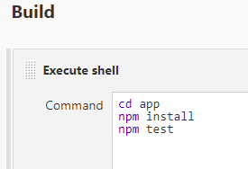
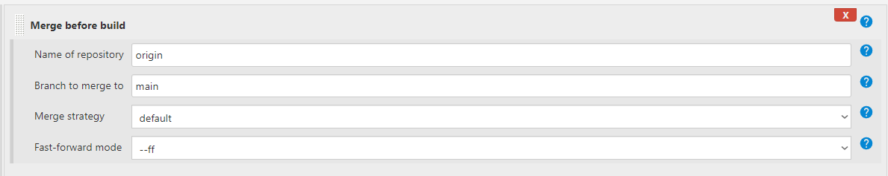
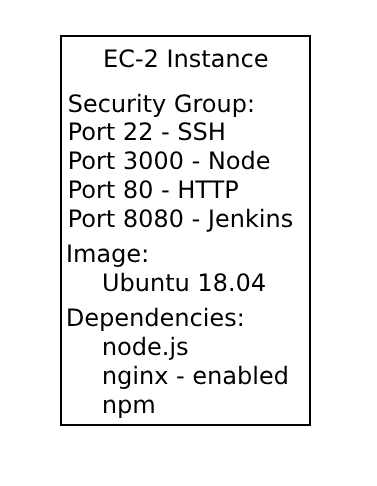

# CI/CD - What? Why? When? How?
## What is CI/CD?
  
- CI/CD stands for Continuous Integration/Continuous Deployment.
-  It is a software development practice that aims to automate the process of integrating code changes into a shared repository which is called continuous integration, and then automatically deploying those changes to production or other environments, which is called continuous deployment.
## Why should we use CI/CD?
CI/CD has numerous benefits:
  - Maximized creativity and efficiency in software development and release.
  - Higher efficiency and increased productivity.
  - Reduced risk of defects.
  - Faster product delivery.
  - Quick rollback if issues arise.
  - Automation reduces costs.
  - Fault isolation.
  - Accelerated release rate.
## When is CI/CD appropriate?
There are various situations where the implementation of CI/CD is not only appropriate but also essential:
   - Team Collaboration
     - Teams may be impelmenting frequent code changes
   - Automated testing
   - Fast and Reliable deployment
   - Continous approach
     - CI/CD uses a continous feedback loop where the development, testing, and operations teams are linked. This allows for issues to be quickly solved.
## How can CI/CD be implemented?

## What is a Webhook?
A webhook is an HTTP-based callback function that allows lightweight, event-driven communication between two applications.

Webhooks are triggered by specific events and send data from one application to another.

They are commonly used to automate processes, such as sending notifications, updating data, or triggering actions in response to events.

## What is the difference between delivery and deployment in producation?
In software development, delivery refers to the process of making the software available for testing or release. 

Deployment includes activities such as configuring the software, setting up the necessary infrastructure, and ensuring that the software runs smoothly in the production environment.

## Visualising how CI/CD works

# Setting up Continuous Integration using Jenkins

## 1. New item
Select new item on the Jenkins Burger Menu 

## 2. Enter the Name -> Select Freestyle Project

## 3. Set it as a GitHub project

## 4. Restrict where the project can be run.
In our case we want it run on an instance that is running ubuntu with node installed.

## 5. Create an SSH key pair
Set the private key up on Jenkins: 
 
Set the public key up on GitHub: 
 

## 6. Creating a webhook
Tick GitHub hook trigger as a build trigger option. 
 
Go to GitHub and set the Payload URL as the Jenkins IP appended with `/github-webhook/` 
 
Select pushes, and pull requests as triggers.  
 

## 7. Save, Build, and Test
Save your project, and create your first build. 
To test that the webhook is working, commit and push something to your GitHub repository. 
This is the expected outcome: 

# CI using Jenkins

## Task 1 - Creating a dev branch in the app repository.
Create a new github repo and push the app folder to this repo: 
https://github.com/Martin-Muraskovas/cicd_learning 

## Task 2 - Create 2 Jobs to test and then merge code committed to the dev branch
1. Create a dev branch using git. 
`git checkout -b dev`

2. Make a change to the dev branch locally, push to github. Your jenkins job should trigger a new job if the tests pass on the dev branch. 
Follow this [guide](https://github.com/Martin-Muraskovas/cicd_learning/blob/main/jenkins-cicd-first-job.md), however change the branch specifier as shown below.
 
 

3. Your new job should merge the code with the main branch on github.
Bad practice to use git commands. Use a Jenkins plugin instead. 
Select merge before build. 
 
 

### Diagram of Task 2
 

## Task 3
Create an EC-2 instance to be used as a production environment.
This instance should have `Ubuntu 18.04 LTS` as the image.
The security group should allow:
   - Port 22 for SSH
   - Port 8080 for Jenkins
   - Port 3000 for node.js
   - Port 80 for HTTP

We also need to install node.js and nginx.

### Diagram of Task 3
 

## Task 4

- Automate the process of step 1
- Copy the code
- Manually ssh in and check if code is there
- Manually start the app, check if it works, check if there are the new features
- Go back and automate starting the app

### Diagram of Task 4
