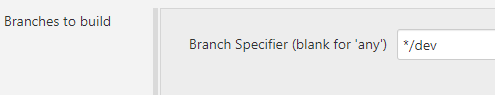
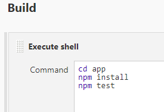
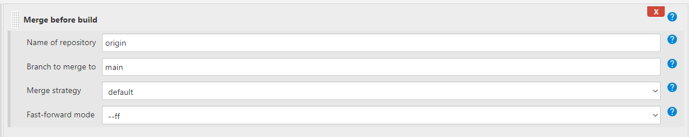
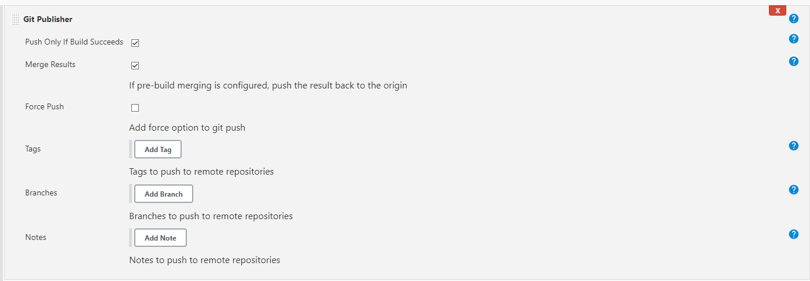
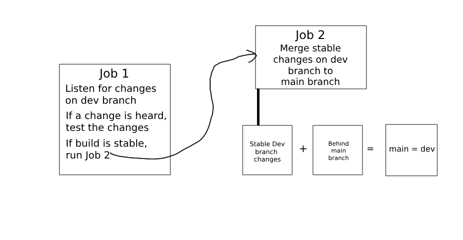

# Continuous Development using Jenkins

## Task 1 - Creating a dev branch in the app repository.
Create a new github repo and push the app folder to this repo: 
https://github.com/Martin-Muraskovas/cicd_learning 

## Task 2 - Create 2 Jobs to test and then merge code committed to the dev branch
1. Create a dev branch using git. 
`git checkout -b dev`

2. Make a change to the dev branch locally, push to github. Your jenkins job should trigger a new job if the tests pass on the dev branch. 
Follow this [guide](https://github.com/Martin-Muraskovas/cicd_learning/blob/main/jenkins-cicd-first-job.md), however change the branch specifier as shown below.
 
 

3. Your new job should merge the code with the main branch on github.
Bad practice to use git commands. Use a Jenkins plugin instead. 
Select merge before build. 
 
 

### Diagram of Task 2
 

## Task 3
Create an EC-2 instance to be used as a production environment.
This instance should have `Ubuntu 18.04 LTS` as the image.
The security group should allow:
   - Port 22 for SSH
   - Port 8080 for Jenkins
   - Port 3000 for node.js
   - Port 80 for HTTP

We also need to install node.js as well as npm.

### Diagram of Task 3

## Task 4

- Automate the process of step 1
- Copy the code
- Manually ssh in and check if code is there
- Manually start the app, check if it works, check if there are the new features
- Go back and automate starting the app

### Diagram of Task 4
