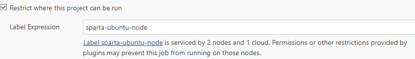
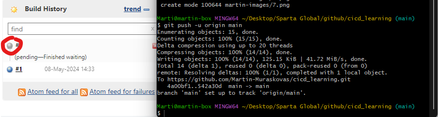

# Setting up Continuous Integration using Jenkins

## 1. New item
Select new item on the Jenkins Burger Menu 

## 2. Enter the Name -> Select Freestyle Project

## 3. Set it as a GitHub project

## 4. Restrict where the project can be run.
In our case we want it run on an instance that is running ubuntu with node installed.

## 5. Create an SSH key pair
Set the private key up on Jenkins: 
 
Set the public key up on GitHub: 
 

## 6. Creating a webhook
Tick GitHub hook trigger as a build trigger option. 
 
Go to GitHub and set the Payload URL as the Jenkins IP appended with `/github-webhook/` 
 
Select pushes, and pull requests as triggers.  
 

## 7. Save, Build, and Test
Save your project, and create your first build. 
To test that the webhook is working, commit and push something to your GitHub repository. 
This is the expected outcome: 
